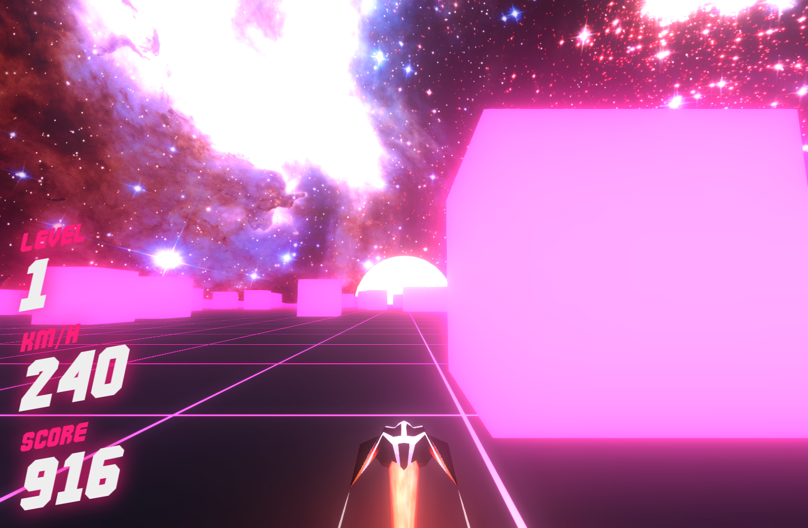

Avoid the cubes while the speed progressively increases! Can you beat the rainbow level?

----
The game is inspired by an old flash game I used to play in the late 2000s called Cubefield. My version is in full 3D and built with React, THREE.js and react-three-fiber to glue them together.

I went for a synthwave aesthetic, including some self-composed music, which the visual effects are synced to (so turn the music on!).

Also features high scores stored locally.

The development process will be detailed on my [website](https://adamkarlsten.com).

## Screenshots

## Controls

* Left: A, LeftArrow

* Right: D, RightArrow

Touch devices have on-screen controls.
